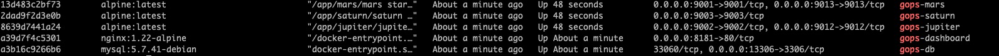

# 天鸿云效发布系统
---
## 安装视频

## Web SSH

## 演示视频

## 平台优点


## UI 展示


## 组件
|名称|描述|
|:--:|:--:|
|fe|gops Web UI项目|
|jupiter|用户权限管理项目|
|mars|部署系统、资产、产品线管理项目|
|saturn|监控管理平台|

## 安装部署
- 容器部署
  ```
  依赖 Docker Compose 2.0+
  执行安装脚本:
  安装: ./gops.sh install

  Note: docker version: 18.09.9
  Note: docker-compose version: 2.10.2
  Gops Deployment Management Script

  Usage:
    ./gops.sh [COMMAND] [ARGS...]

  Installation Commands:
    install           Install gops

  Management Commands:
    start             Start   gops docker containers
    stop              Stop    gops docker containers
    rm                rm      gops docker containers
  docker ps | grep gops
  ```
  
  docker logs gops-jupiter 查看初始登录账号密码

  浏览器访问：http://127.0.0.1:8181
  web ssh 功能： 修改fe/config/config.json 改为容器宿主机的主机ip
  {
    "WEB_SSH_URL": "ws://172.25.2.174:9001"
  }
- 物理机部署
[安装部署文档](https://ztth.gitbook.io/gops/install)

## 技术交流群
